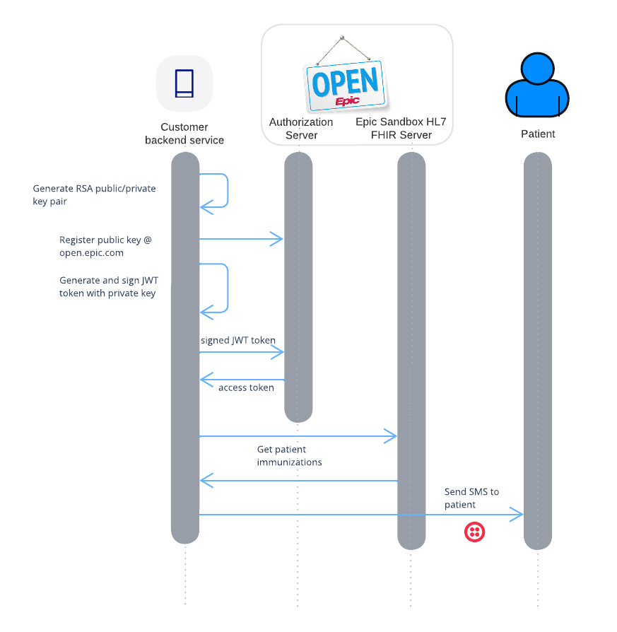
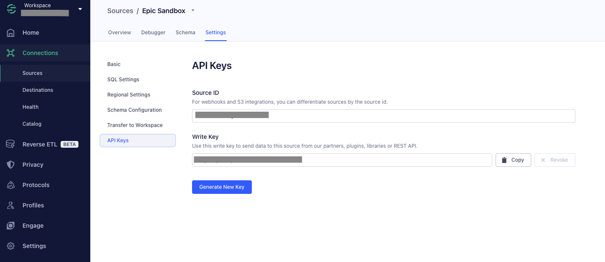
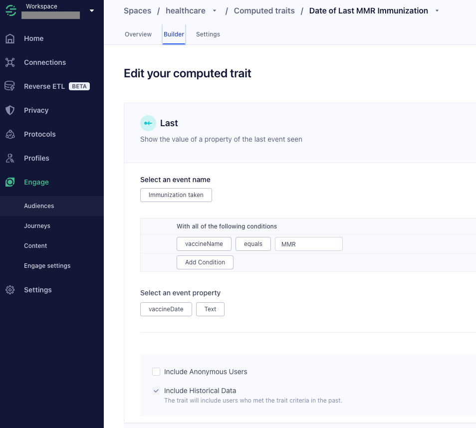
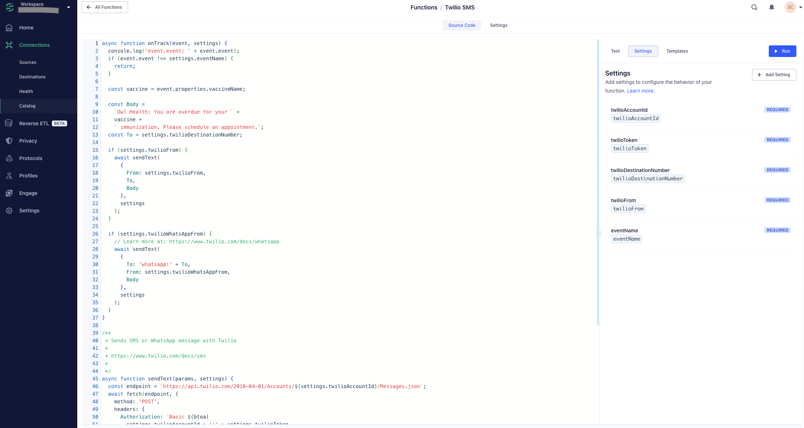
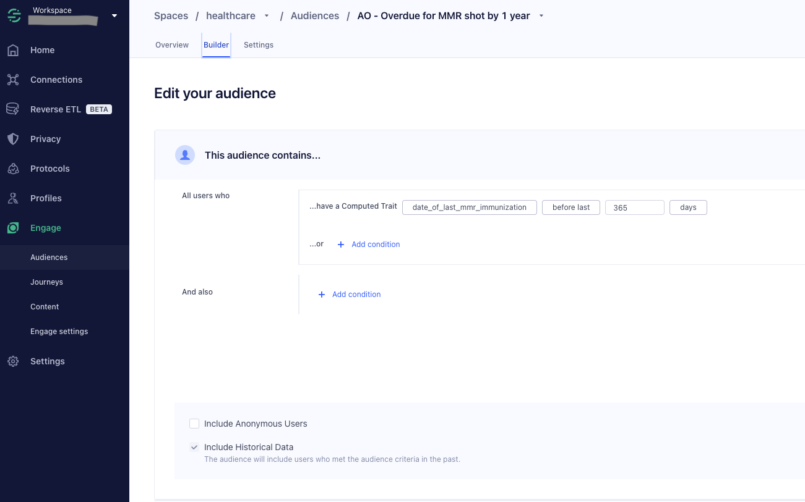
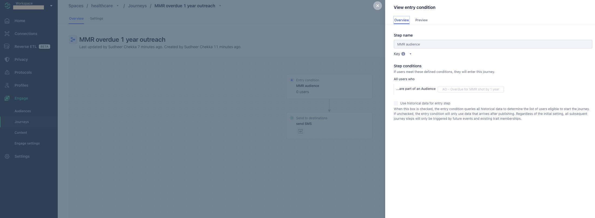

# Patient outreach for overdue immunizations

The goal of this repo is to demonstrate processing patient immunization data from Epic sandbox (open.epic.com) to create SMS outreach to patients with overdue immunizations.

There are 2 parts to this application - (1) node.js based backend application and Twilio Segment to create a campaign

The node.js backend application covers how to accesses patient data from Epic sandbox(open.epic.com) using FHIR APIs and sending that patient data to Twilio's Customer Data Platform, Segment. This application uses OAuth 2.0 authentication to access FHIR APIs.  A public key is first pre-registered on open.epic.com and uses the corresponding private key to sign a JSON Web Token (JWT) which is presented to the authoriaztion server to obtain an access token. This access token is used to call FHIR APIs on the Epic sandbox.




### 1. Configure Segment (Customer Data Platform)
Here are the instructions to set up Twilio Segment to receive patient profile and immunization data, create audience of overdue patients and send SMS campaign.

###### 2. Create a node.js source to receive the patient data. The Write Key is used in the node.js application to send the patient data to Segment


###### 3. Create a computed trait for the patient to store the last immunization data


###### 4. Create a Segment Function to send SMS using Twilio SMS API. The source code is here (segment-function.js). Configure the setting based on your Twilio account


###### 5. Create Segment audience for all the patients with last immunization date more than 1 year back used the computed trait



###### 6. Create a journey that will trigger when overdue patients enter the audience to send SMS



### node.js application set up and demo script instructions
1. Create Public Private Key Pair
* you can use openssl or similar tools to generate them

2. Create a build app @ open.epic.com
* Select all applicable Incoming APIs
* Upload your public key from previous step
* Select SMART on FHIR veersion. [STU3 for this kitchensink]
* Save & Ready for Sandbox

3. Populate environmant variables 
* Make a copy of .env.example 
```bash
cp .env.example .env
```
* client_id = Enter Non-Production Client ID from your build app from previous step
* private_key = enter the private key from Step 1

4. Install npm dependencies

```bash
npm install on the root folder
```

5. Send patient profile data to Segment

```bash
node patient-profile.js
```

6. Send patient immunization data from Epic sandbox to Segment

```bash
node patient-immunizations.js
```
